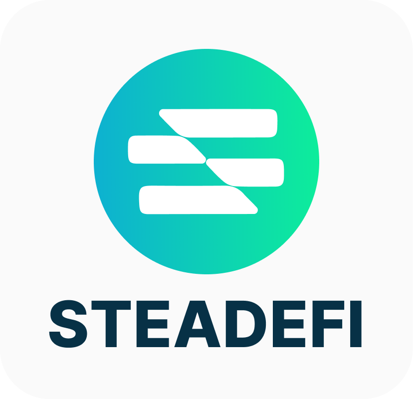
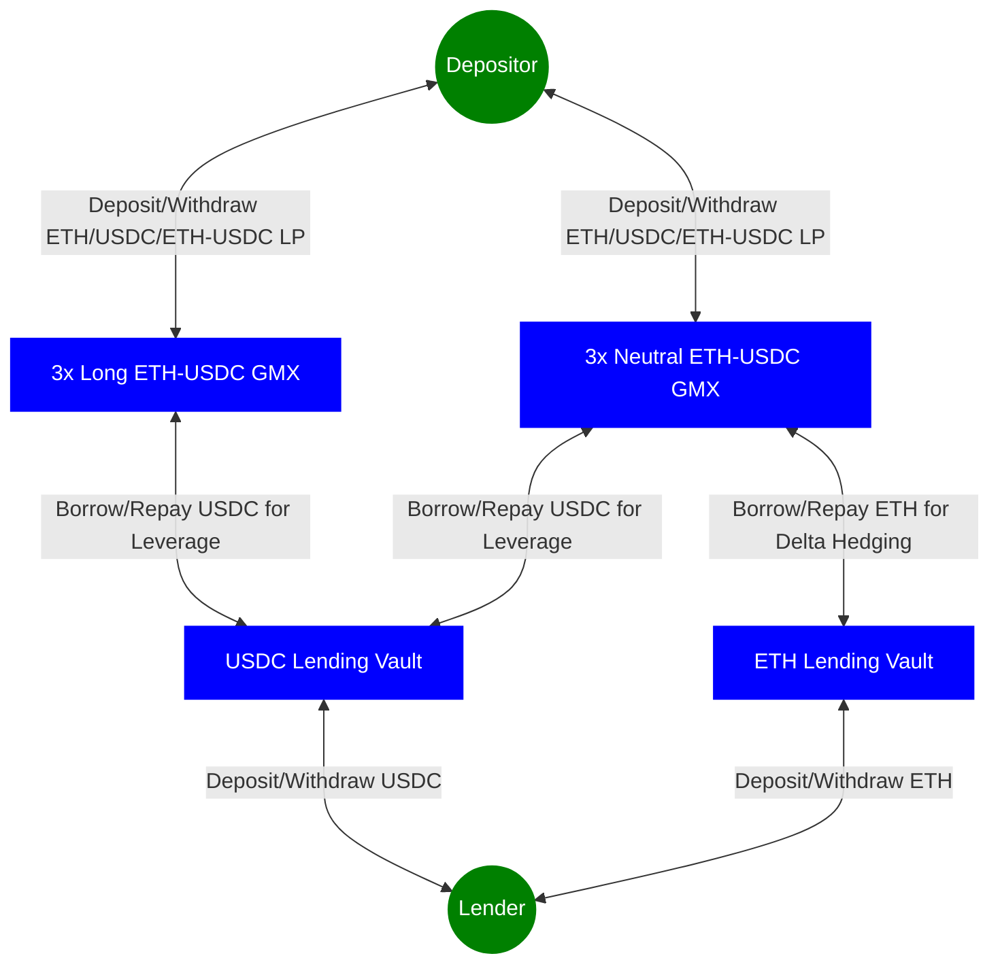

# Steadefi Codehawks Audit
​
<p align="center">
  
</p>

​
## Contest Details
- Total Prize Pool: $35,000
  - HM Awards: $30,000
  - Low Awards: $5,000
  - No gas, informational, or QAs
- Start: 26th October 2023 12:00pm UTC
- End: 6th November 2023 12:00pm UTC
​

## Stats
- nSLOC: 2,324
- Complexity Score: 1,590
- Dollars per nSLOC: ~$15
- Dollars per Complexity: ~$22

<!-- - nSLOC: 1907
- Complexity Score: 1259
- Dollars per nSLOC: ~$18
- Dollars per Complexity: ~$27 -->

​
## About
Steadefi provides vaults with automated risk management for earning leveraged yields effectively and passively in bull, crab and bear markets. With lending and leveraged delta long and neutral stategies, Steadefi's vaults cater to different risk/reward strategies to the best yield-generating DeFi protocols.

As of October 2023, Steadefi is looking to launch vaults that earn yield from GMX v2 on Arbitrum and Avalanche network.
​

## Official Links
- [Protocol Documentation](https://docs.steadefi.com)
- [Website](https://www.steadefi.com)
- [Front-End Interface](https://www.steadefi.com/vaults)
- [Blog](https://blog.steadefi.com)
- [Twitter](https://twitter.com/steadefi)
- [Discord](https://discord.gg/steadefi)
​

## Protocol Overview
There are 2 types of vaults: **Lending Vaults** and **Strategy Vaults**.

A typical set up for 3x Leverage, Delta Long and Delta Neutral strategies to the ETH-USDC GM LP pool on GMXv2, with isolated ETH and USDC lending vaults are as follows:



> Note that Delta Long strategies borrow only USDC for more leverage, while Delta Neutral strategies borrow both USDC for leverage **as well as** borrow ETH in order to delta hedge the ETH exposure of the liquidity provided to the ETH-USDC GM LP pool (borrowing = hedging).

### Steadefi Front-End Interface Screenshot


### Further Documentation
🚨 **For more details, please check out the [Technical Documentation](./docs/technical-documentation.md) directory in this repository.**


## Actors
| Role | Responsibilities |
| ------ | --------------- |
| Lender | Lenders deposit assets to Lending Vaults (1 asset per Lending Vault) to earn safer, more stable borrow interest on their assets. |
| Depositor | Depositors deposit assets to Strategy Vaults (Strategy Vaults could accept different assets) to earn earn higher yields than if they were to supply their assets to the yield-earning protocol directly. Depending on the strategy however, they take on different types of risk which would affect their final profit and losses. |
| Keeper | Keepers are automated "bots" that run 24/7, frequently scheduled and/or event-triggered code scripts to perform various protocol maintainence tasks. These tasks include updating of borrow interest rates for Lending Vaults, rebalancing Strategy Vaults whose health are out of its' strategy parameter limits, compounding earned yield for Strategy Vaults, reverting certain issues for strategy vaults when they occur and triggering Emergency Pauses for lending and strategy vaults in the event of any possible issues. |
| Owner | Owner are administrators that have rights to configure and update various sensitive vault configurations and parameters. Owners of deployed smart-contracts (vaults, oracles, etc.) should be Timelocks of which are managed by Multi-Sigs that require at least a 2 out of 3 signing approval for any transactions to happen with a 24 hours delay. Note that on contract deployment, the immediate Owner is the hot wallet deployer account. After deploying and initial configuration of the contract, the ownership should be immediately transferred from the hot wallet deployer to a Timelock managed by a Multi-Sig. |


## Scope
### Contracts in scope:
```js
contracts
├── interfaces
    ├── oracles
        ├── IChainlinkOracle.sol
        ├── IGMXOracle.sol
    ├── strategy
        ├── gmx
            ├── IGMXVault.sol
            ├── IGMXVaultEvent.sol
├── oracles
        ├── ChainlinkARBOracle.sol
        ├── GMXOracle.sol
├── strategy
        ├── gmx
            ├── GMXCallback.sol
            ├── GMXChecks.sol
            ├── GMXCompound.sol
            ├── GMXDeposit.sol
            ├── GMXEmergnecy.sol
            ├── GMXManager.sol
            ├── GMXProcessDeposit.sol
            ├── GMXProcessWithdraw.sol
            ├── GMXReader.sol
            ├── GMXRebalance.sol
            ├── GMXTypes.sol
            ├── GMXVault.sol
            ├── GMXWithdraw.sol
            ├── GMXWorker.sol
└── utils
    ├── Errors.sol
```

### Contracts out of scope:
```js
contracts
├── interfaces
    ├── lending
    ├── protocols
    ├── swap
    ├── tokens
├── lending
├── mocks
├── swaps
└── utils
    ├── OptimalDeposit.sol
​
```
​
## Compatibilities
Blockchains:
  - Arbitrum
  - Avalanche

Tokens on Arbitrum:
  - ETH
  - WETH: `0x82aF49447D8a07e3bd95BD0d56f35241523fBab1`
  - WBTC: `0x2f2a2543B76A4166549F7aaB2e75Bef0aefC5B0f`
  - ARB: `0x912CE59144191C1204E64559FE8253a0e49E6548`
  - LINK: `0xf97f4df75117a78c1a5a0dbb814af92458539fb4`
  - SOL: `0x2bCc6D6CdBbDC0a4071e48bb3B969b06B3330c07`
  - UNI: `0xfa7f8980b0f1e64a2062791cc3b0871572f1f7f0`
  - USDC: `0xaf88d065e77c8cC2239327C5EDb3A432268e5831`
  - ETH-USDC GM: `0x70d95587d40a2caf56bd97485ab3eec10bee6336`
  - WBTC-USDC GM: `0x47c031236e19d024b42f8AE6780E44A573170703`
  - ARB-USDC GM: `0xC25cEf6061Cf5dE5eb761b50E4743c1F5D7E5407`
  - LINK-USDC GM: `0x7f1fa204bb700853D36994DA19F830b6Ad18455C`
  - SOL-USDC GM: `0x09400D9DB990D5ed3f35D7be61DfAEB900Af03C9`
  - UNI-USDC GM: `0xc7Abb2C5f3BF3CEB389dF0Eecd6120D451170B50`

Tokens on Avalanche:
  - AVAX
  - WAVAX: `0xB31f66AA3C1e785363F0875A1B74E27b85FD66c7`
  - BTC.b: `0x152b9d0FdC40C096757F570A51E494bd4b943E50`
  - WETH.e: `0x49D5c2BdFfac6CE2BFdB6640F4F80f226bc10bAB`
  - SOL: `0xFE6B19286885a4F7F55AdAD09C3Cd1f906D2478F`
  - USDC: `0xb97ef9ef8734c71904d8002f8b6bc66dd9c48a6e`
  - AVAX-USDC GM: `0x913C1F46b48b3eD35E7dc3Cf754d4ae8499F31CF`
  - BTC.b-USDC GM: `0xFb02132333A79C8B5Bd0b64E3AbccA5f7fAf2937`
  - WETH.e-USDC GM: `0xB7e69749E3d2EDd90ea59A4932EFEa2D41E245d7`
  - SOL-USDC GM: `0xd2eFd1eA687CD78c41ac262B3Bc9B53889ff1F70`
​
## Setup
Install all project dependencies with yarn
```bash
yarn
```

Compile all contracts
```bash
yarn compile
```

### Deployment
Deploy scripts are all in the `/scripts` directory. Short-cut helper bash functions are in `package.json`.

Note that deployment for different chains or strategies may have different contracts to deploy.

The steps below are for deploying strategy vaults for ETH-USDC on GMX, using Uniswap for asset swaps.

**After deploying a contract successful, the address of the contract should be updated in `constants.ts` file accordingly so future deploy scripts can utilise the correct deployed contracts.**

**0) Add deployer wallet private key to `.env`**

Add deployer private key to `.env`
```javascript
PRIVATE_KEY_DEPLOYER=<PRIVATE_KEY_OF_DEPLOYER_WALLET>
```

**1) Deploy Chainlink Oracle**
```bash
npx hardhat run --network arbitrumOne scripts/arb/oracles/deploy-oracle-chainlink-arb.ts
```
Note that the price feeds for ETH and USDC should be updated to this oracle.

This oracle is re-usable for future Arbitrum protocol oracles and strategy vaults.

**2) Deploy GMX Oracle**
```bash
npx hardhat run --network arbitrumOne scripts/arb/oracles/deploy-oracle-gmx.ts
```
This oracle is re-usable for future GMX strategy vaults.

**3) Deploy a Swap**
```bash
npx hardhat run --network arbitrumOne scripts/arb/swap/deploy-swap-uniswap.ts
```
Note that the fee tiers for ETH and USDC swap pool should be updated in this swap.

This swap is re-usable for future Arbitrum strategy vaults.

**4) Deploy Lending Vaults**
```bash
# Deploy a native ETH Lending Vault
npx hardhat run --network arbitrumOne scripts/arb/lending/deploy-lending-vault-native.ts

# Deploy a USDC Lending Vault
npx hardhat run --network arbitrumOne scripts/arb/lending/deploy-lending-vault-stable.ts
```

These lending vaults will be re-usable for future ETH-USDC GMX strategy vaults.

**5) Deploy Strategy Vaults**
```bash
# Deploy re-usable strategy vault external library contracts
npx hardhat run --network arbitrumOne scripts/arb/strategy/gmx/deploy-strategy-gmx-libraries.ts

# Deploy a Leveraged Long strategy vault
npx hardhat run --network arbitrumOne scripts/arb/strategy/gmx/deploy-strategy-gmx-long-eth.ts

# Deploy a Leveraged Neutral strategy vault
npx hardhat run --network arbitrumOne scripts/arb/strategy/gmx/deploy-strategy-gmx-neutral-eth.ts
```

The library contracts deployed will also be re-usable for other GMX strategy vaults.

**5) Post-Deployment Setup (optional for audit)**
- Configure Keepers (Relayers, Sentinels, Autotasks)
- Configure back-end data collection and database
- Configure front-end interface
​

### Testing

Tests coverage
```bash
forge coverage
```

Run all tests
```bash
forge test
```

Run a particular test suite
```bash
forge test --match-contract GMXDepositTest
```

Run a particular test with calltrace
```bash
forge test --match-test test_createDeposit -vvvv
```
​
## Known Issues
WIP